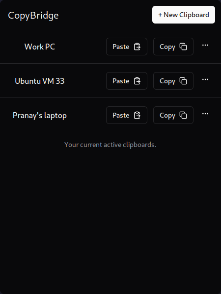

# CopyBridge

<center>



</center>


## CLI

```
connect <addr>
create <name> [ -p <password> ] [ -f ]
add <id> [ -p <password> ] [ -f ]
list
copy [ -i <id> | -n <name> ] [ --echo ]
paste [ -i <id> | -n <name> ] [ -d <data_type> ] [ <content> | -f <file> ]
remove [ <id> | <name> ]
delete <id> [ -p <password> ]
```

## Config File

```toml
server="http://localhost:8383"

[[clipboards]]
id=100004
name="test"
password="bXlwYXNzCg==" # base64 encoded for "mypass"

[[clipboards]]
id=100005
name="another test"
```

## TODO
- [ ] Branding: Icon
- [ ] Names are independent to each device:
  - [ ] Add optional `name` field to `AddArgs` (Seperate `AddDeleteArgs`)
  - [ ] Ask for name in cli while `add`
  - [ ] Add name field in GUI for `Add Clipboard`
  - [ ] Store the user's input locally
- [ ] Global shortcut
- [ ] Server setup at first launch
- [ ] Auto launch at login
- [ ] Settings page
  - [ ] shortcut
  - [ ] server_url
  - [ ] autolaunch